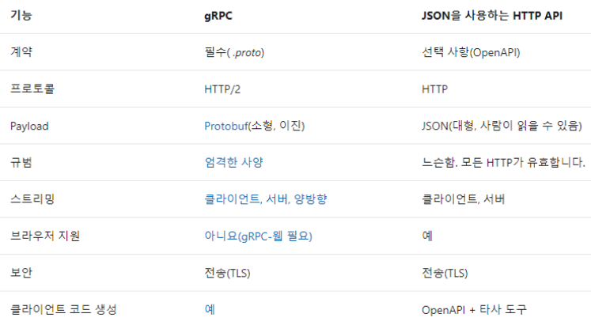

# gRPC

## gRPC 장점

- 성능  
    grpc는 binary message 형식의 Protobuf를 이용해 메세지를 serialize.  
    작은 payload (공간측면)를 발생시키고, serialize 하는 속도 (시간측면)도 우수함
- 스트리밍 기능  
    HTTP/2 를 사용하기 때문에 여러가지 스트리밍 기능을 구현할 수 있음  
    - 서버 -> 클라이언트
    - 서버 <- 클라이언트
    - 서버 <> 클라이언트
- timeout 설정  
    client 가 RPC가 완료될 때 까지 대기하는 시간을 지정할 수 있음

## gRPC 단점
- 브라우저 지원  
    FE에서 바로 가져다 쓰기 어려운 듯 하다 (지원이 안됨)
- Not Human Readable Payload  
    protobuf 로 직렬화해서 통신하니까 디버깅이 힘들 것 같기는 하다

## gRPC의 주 사용처
- 서버에서 큰 자료를 클라이언트에게 스트리밍 형태로 제공할 때 필요할 듯 하다
- MSA로 인해 서비스들끼리 통신할 일이 잦을 때, 성능과 엄격한 사양 (protobuf 의 형식) 등의 이유로 유리할 듯 하다

## 그래서 이 폴더에서는..
- Python, Go 를 이용해 각각 Server와 Client 를 만들어 작은 동영상을 스트리밍 하는 시나리오를 구현해보고자 한다.
- 구현이 끝나면 서버에 DL 모델 띄워놓고 결과를 스트리밍하는 시나리오도 구상해볼까 하는데.. 뭐가 있을진 아직 모르겠다